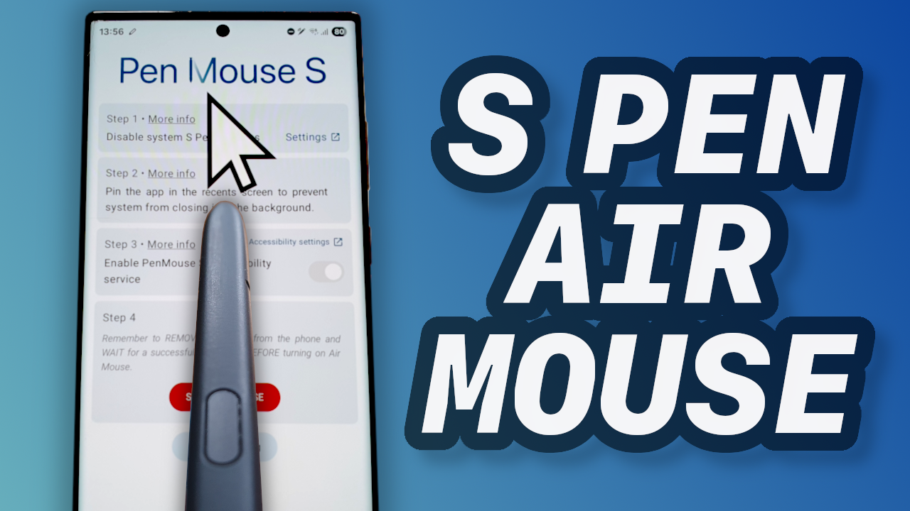
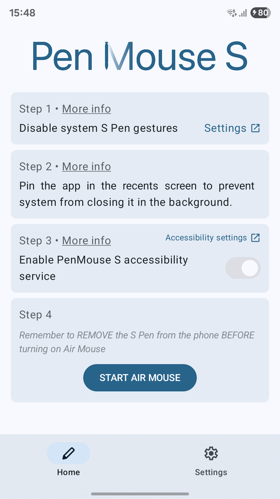
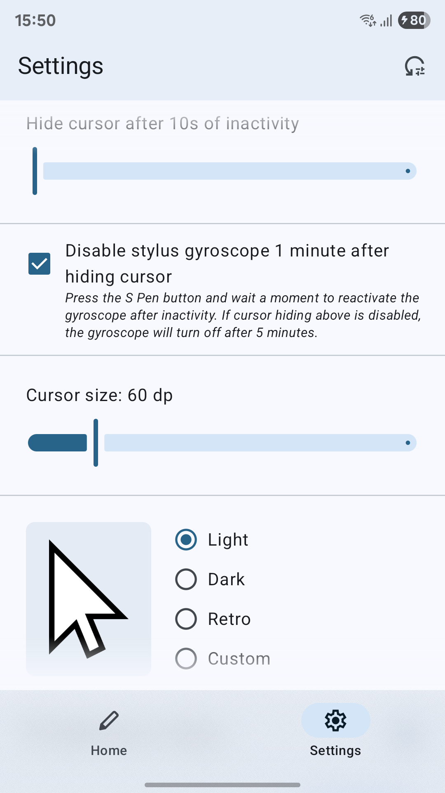
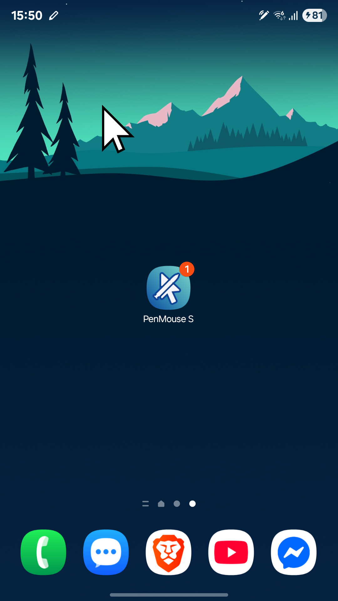

<p align="center">
  
</p>

# PenMouse S
PenMouse S is an app that allows you to use the S Pen available on certain Galaxy devices to control the phone's on-screen cursor using air gestures.

The app was created thanks to the encouragement of many people from [this Reddit thread](https://www.reddit.com/r/GalaxyS23Ultra/comments/1jbt0bk/i_made_a_simple_game_for_s_pen_and_want_to_show/) after the small success of the [Bird Hunt](https://github.com/jojczak/BirdHunt) game - thanks to everyone for the ideas and feedback!

## How does it work?
The app uses the gyroscope built into the S Pen to track its movements. It then displays an on-screen cursor overlay using Android's Accessibility API. When the S Pen button is pressed, the app simulates a finger tap on the screen.

One important note: due to limitations of the Accessibility API, all actions are deferred - meaning they are only executed after the S Pen gesture is completed. For example, if you hold the S Pen button and draw a circle in the air, the app will simulate that motion only after you release the button, not while you're drawing it.

### Features
In addition to the mouse control mentioned earlier, the app also allows you to:
- Adjust the cursor size
- Change the mouse sensitivity
- Automatically hide the cursor after a period of inactivity so it doesn’t get in the way
- Turn off the S Pen gyroscope after a period of inactivity to save battery
- Change the cursor icon — the app includes three default icons, and you can also set a custom one

The app also includes a detailed setup guide with videos explaining how to prepare your phone for using the S Pen as a mouse. This is especially useful because some of the S Pen’s built-in features need to be disabled to prevent them from interfering with the PenMouse S.

You can see a demonstration of the app in this video:</br>
[](https://youtu.be/SMZjguBtFQQ)

## Supported devices
<ins>**This app works ONLY on Samsung phones that have an S Pen with [Air Actions](https://www.samsung.com/us/support/answer/ANS10003221/) functionality.**</ins> Even if your device has a stylus but is not a Samsung device, the PenMouse S will not work, as it uses Samsung's SDK specifically for S Pen.
- Samsung Galaxy Note Series: **Galaxy Note10**
- Samsung Galaxy S Ultra Series: **Galaxy S20-S24 Ultra**
- Samsung Galaxy Tab Series: **Galaxy Tab S6** and newer *(Air Actions depend on the specific S Pen model)*

It also requires Android 12 or newer.

The S Pen SDK is quite a niche tool and has long been forgotten by Samsung. In fact, in their latest flagship phone, the S25 Ultra, they removed both Bluetooth connectivity and the gyroscope from the S Pen. So keep in mind that the app might work poorly, have bugs, or not work at all. Unfortunately, it's a bit random and depends on both the pen and the phone - don’t say I didn’t warn you!

## Download
You can download PenMouse S from the [Releases](https://github.com/jojczak/PenMouseS/releases) section here on GitHub or from Google Play:

[](https://play.google.com/store/apps/details?id=pl.jojczak.penmouses)

## Screenshots
   

## Building the Project
1. Clone the repository:
   ```bash
   git clone https://github.com/jojczak/PenMouseS.git
   ```
2. Open Android Studio and click `File > New > Import Project` and select the PenMouseS repository folder.
3. Select the app module from the run configurations dropdown and click the Run button

### Used Libraries
- Jetpack Compose - Declarative UI toolkit for building native Android apps
- Hilt - Dependency injection framework
- [Haze](https://github.com/chrisbanes/haze) by [@chrisbanes](https://github.com/chrisbanes) - Real-time blur effects for Jetpack Compose
- [S Pen Remote SDK](https://developer.samsung.com/galaxy-spen-remote/overview.html) - Samsung's SDK for accessing motion and button input from the S Pen
- Android Accessibility Service API - Used to simulate touch events and show custom overlays

## Legal
"Samsung" and "S Pen" are registered trademarks of Samsung Electronics Co., Ltd.</br>
This app is not affiliated with, endorsed, or sponsored by Samsung Electronics Co., Ltd.
